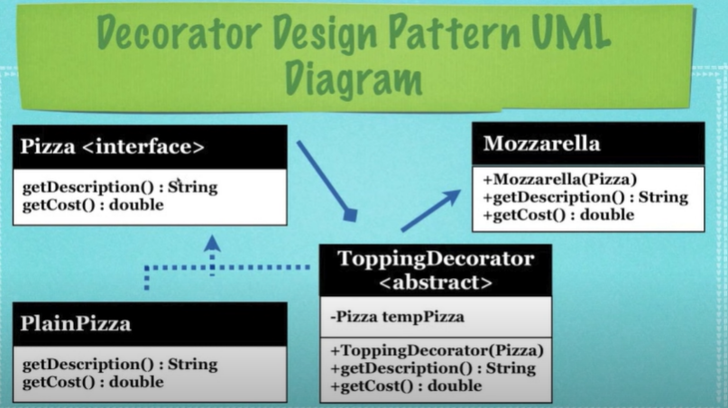

The decorator pattern allows you to modify an object dynamically.
 - It is used when you want the capabilities of inheritance with subclasses, but you need to add functionality at run time
 - It is more flexible than inheritance
 - Simplifies code because you add functionality using many simple classes
 - Rather than rewrite old code you can extend with new code

